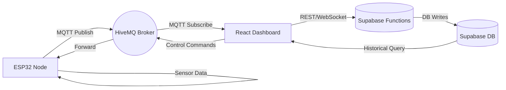

# AirMitra-IoT: Smart Home Automation System

## 1. Title Page

| Field         | Value (Fill In)                                        |
| ------------- | ------------------------------------------------------ |
| Project Title | AirMitra-IoT: Smart Home Automation System             |
| Student Name  | YOUR NAME HERE                                         |
| Roll Number   | YOUR ROLL NUMBER                                       |
| Department    | YOUR DEPARTMENT (e.g., Electronics & Communication)    |
| College Name  | YOUR COLLEGE NAME                                      |
| Semester      | e.g., 7th Semester                                     |
| Academic Year | 2025–2026                                              |
| Guide Name    | GUIDE / SUPERVISOR NAME                                |
| Team Members  | Yuvraj Mehta, Sumit Kumar, Akshat Kumar, Vishal Thakur |

> Replace placeholders with actual academic details when finalizing.

---

## 2. Certificate

(Department-issued certificate will be inserted here. Placeholder for official approval page.)

---

## 3. Acknowledgement

> We express our sincere gratitude to [Guide Name] for invaluable guidance, the faculty of [Department] for academic support, our peers for constructive feedback, and our families for continuous encouragement. This project would not have been possible without collaborative effort, resources, and mentorship.

---

## 4. Abstract

This project presents **AirMitra-IoT**, a comprehensive smart home automation system designed to intelligently control lighting and ventilation based on environmental conditions and user preferences. The system utilizes an ESP32 microcontroller integrated with a DHT22 temperature-humidity sensor, PIR motion sensor, and RGB LED for ambient lighting control. The architecture implements MQTT protocol for real-time bidirectional communication between IoT devices and a web-based dashboard built with React, TypeScript, and Vite. The system features dual operation modes (AUTO/MANUAL), where AUTO mode automatically controls a smart bulb based on motion detection and adjusts fan operation based on a temperature threshold. Real-time sensor data is displayed on an SSD1306 OLED and logged to a Supabase PostgreSQL database for historical analytics. The dashboard provides remote control of bulb state, fan speed (0–100%), RGB color, and mode switching. The project demonstrates energy-efficient home automation with seamless cloud integration, validating the feasibility of cost-effective IoT systems for residential comfort optimization.

---

## 5. Introduction

**Internet of Things (IoT)** connects physical devices to the internet for data exchange and intelligent control. Home automation is a leading IoT application aimed at improving energy efficiency, comfort, and accessibility.

**Purpose:** AirMitra-IoT automates lighting and ventilation using environment-aware rules and provides remote, real-time monitoring.

**Objectives:**

1. Automate fan activation based on temperature (>28°C).
2. Automate lighting based on motion with inactivity timeout.
3. Provide dual-mode operation (AUTO vs MANUAL override).
4. Enable remote control via web dashboard (bulb, fan, RGB, mode).
5. Log sensor/device states for historical analysis.
6. Offer real-time visualization via OLED and browser.
7. Support scalable cloud-based architecture (Supabase + MQTT).

---

## 6. Problem Statement

Traditional home appliances lack environmental awareness and require manual operation, causing energy waste (e.g., fans running in cool conditions or lights left on without occupancy). Users also lack remote control and centralized monitoring. There is a need for an intelligent IoT-based system that can automatically manage lighting and ventilation based on temperature and motion, while allowing manual override and historical data insight.

---

## 7. Proposed System

A hybrid cloud-edge IoT platform where an **ESP32** node collects sensor data and controls actuators, communicating via **MQTT** with a **React Web Dashboard** and logging data to **Supabase**.

**Components:**

- ESP32 DevKit V1 firmware (`Simulation/src/sketch.ino`)
- Sensors: DHT22 (temperature, humidity), PIR motion
- Actuators: Relay-driven fan, LED smart bulb simulation, RGB LED
- Display: SSD1306 OLED for local status
- Control: Physical buttons for mode, bulb, fan
- Cloud: Supabase database + serverless functions
- Protocol: MQTT (HiveMQ public broker)
- User Interface: Real-time dashboard with device controls and analytics

**Automation Rules:**

- Temperature > 28°C → Fan ON (AUTO)
- No motion for 30s → Bulb OFF (AUTO)
- Motion detected → Bulb ON (AUTO)
- MANUAL mode overrides all automation

---

## 8. System Architecture Diagram

(Use the Wokwi wiring + a block diagram depicting: ESP32 ↔ MQTT Broker ↔ React Dashboard ↔ Supabase DB; Include sensors & actuators.)

Files aiding diagram:

- `Simulation/diagram.json` (Wokwi circuit)
- Suggest producing a Mermaid diagram:



---

## 9. Hardware Components

| Component                         | Purpose             | Pin Mapping        |
| --------------------------------- | ------------------- | ------------------ |
| ESP32 DevKit V1                   | MCU + WiFi          | -                  |
| DHT22 Sensor                      | Temp/Humidity       | GPIO15             |
| PIR Motion Sensor                 | Motion detection    | GPIO14 (Interrupt) |
| LED Bulb (Simulated)              | Lighting control    | GPIO2              |
| Relay Module                      | Fan power switching | GPIO13 (IN)        |
| PWM Fan (simulated via speed var) | Ventilation control | GPIO4 (PWM)        |
| RGB LED                           | Ambient lighting    | R:25 G:26 B:27     |
| SSD1306 OLED                      | Status display      | I2C SDA:21 SCL:22  |
| Button: Mode                      | Toggle AUTO/MANUAL  | GPIO32             |
| Button: Bulb                      | Manual bulb toggle  | GPIO33             |
| Button: Fan                       | Manual fan toggle   | GPIO5              |
| Resistors (250Ω)                  | LED current limit   | Series with LEDs   |
| Breadboard + Wires                | Assembly            | -                  |
| Power Supply (USB 5V)             | System power        | VIN/5V             |

Wiring reference in `Simulation/diagram.json`.

---

## 10. Software Components

**Firmware:** Arduino framework (PlatformIO config: `Simulation/platformio.ini`).
Libraries:

- `PubSubClient`, `DHT sensor library`, `Adafruit_GFX`, `Adafruit_SSD1306`, `Wire`, `WiFi.h`

**Frontend:** React + TypeScript + Vite, Tailwind CSS, shadcn/ui components, MQTT.js, Supabase JS, React Router, Recharts.

**Backend (Supabase):** PostgreSQL tables: `sensor_data`, `device_states`, `system_events`. Deno serverless functions for MQTT bridging and analytics.

**Key File References:**

- MQTT context: `nexus-comfort-core-main/src/contexts/MQTTContext.tsx`
- Sensor logger: `nexus-comfort-core-main/src/hooks/useSensorLogger.ts`
- Supabase client: `nexus-comfort-core-main/src/integrations/supabase/client.ts`
- Functions: `supabase/functions/*`
- Firmware: `Simulation/src/sketch.ino`

---

## 11. Working Principle

1. ESP32 boots, connects to Wi-Fi, sets up MQTT, sensors, OLED.
2. Subscribes to control topics (`yuvraj/home/control/*`).
3. Periodically publishes temperature, humidity, fan speed, motion status, bulb/fan state, mode, color.
4. PIR interrupt updates motion state instantly; publishes `DETECTED` / `NONE`.
5. AUTO mode enforces rules; MANUAL mode respects user commands only.
6. Dashboard publishes control commands to MQTT; firmware reflects changes.
7. OLED renders real-time device and environment status (including motion inactivity timer).
8. Supabase functions and frontend logger persist data for history and AI analysis.

---

## 12. System Features

### Smart Bulb

- Remote ON/OFF (topic: `yuvraj/home/control/bulb`)
- Motion-based activation + timeout (30s)
- Manual override via button (GPIO33)
- State topic: `yuvraj/home/bulb`

### Smart Fan

- Temperature-triggered activation (>28°C)
- PWM-based speed (0–100%) published to `yuvraj/home/fan/speed`
- Relay ON/OFF state (`yuvraj/home/fan`)
- Manual toggle (GPIO5)

### RGB Lighting

- Hex color input (#RRGGBB) → PWM channels
- Color updates published to `yuvraj/home/color`

### Mode Control

- Dual mode: AUTO vs MANUAL
- Toggle button (GPIO32) or dashboard command (`yuvraj/home/control/mode` → `TOGGLE`)

### Monitoring & Logging

- Live sensor data
- OLED display status
- Historical Supabase persistence
- Event logging in `system_events`

### Dashboard

- Real-time device & sensor cards
- Fan speed slider
- RGB color picker
- Motion indicator
- Connection status

---

## 13. Flowcharts (Conceptual)

**Main Loop:**

```
Init → Connect MQTT → Subscribe → Publish initial states → Loop
  ├─ Read sensors
  ├─ Handle buttons (debounced)
  ├─ Process MQTT messages
  ├─ If AUTO: apply temperature + motion rules
  ├─ Publish periodic sensor data
  └─ Update OLED
```

**Motion Logic:**

```
PIR interrupt → motion=true → Publish DETECTED → Reset timer
If inactivity > 30s → Publish NONE → Turn bulb OFF (AUTO only)
```

**MQTT Callback:**

```
On message:
  if control/bulb → setBulb()
  if control/fan → setFan()
  if control/fan/speed → setFanSpeed()
  if control/color → parse hex → setRGB()
  if control/mode → toggleMode()
```

---

## 14. Implementation

**Key Firmware Functions (from `sketch.ino`):**

- `setBulb(bool state, bool fromManual)`
- `setFan(bool state, bool fromManual)`
- `setFanSpeed(int speed)`
- `setRGB(uint8_t r,g,b)`
- `toggleMode()`
- `updateOLED(float t,float h)`
- `callback(char* topic, byte* message, unsigned int length)`
- `reconnectMQTT()` / `publishAllStates()`
- `IRAM_ATTR motionISR()`

**MQTT Topics:**
Publish: `yuvraj/home/temp`, `hum`, `motion`, `bulb`, `fan`, `fan/speed`, `color`, `mode`
Control: `yuvraj/home/control/bulb`, `fan`, `fan/speed`, `color`, `mode`

**Frontend Data Model:**

```ts
interface SensorData {
  temperature: number;
  humidity: number;
  motionState: boolean;
  bulbState: "ON" | "OFF";
  fanState: "ON" | "OFF";
  fanSpeed: number;
  rgbColor: string;
  mode: "AUTO" | "MANUAL";
}
```

**Database Schema (Supabase Migrations):**

- `sensor_data(temperature, humidity, motion_detected, timestamp)`
- `device_states(bulb_state, fan_state, fan_speed, rgb_color, mode, timestamp)`
- `system_events(event_type, event_data, description, timestamp)`

---

## 15. Results (To Collect)

Include:

- Hardware setup photo / Wokwi screenshot
- OLED display image showing live readings
- Dashboard screenshots (controls, charts, status)
- Supabase table snapshots
- MQTT console logs (message traces)
- Fan activation test (>28°C)
- Motion-triggered bulb test (on/off after 30s)

Performance Summary:

- Motion latency: <100ms
- Sensor publish interval: 5s
- MQTT round trip: <500ms (typical)
- Logging interval: configurable (e.g., 30s in hook)

---

## 16. Applications

- Residential smart homes
- Offices and meeting spaces
- Hotel room automation
- Elderly assistance environments
- Academic IoT learning platform
- Energy monitoring prototypes

---

## 17. Advantages

- Energy efficiency through context-aware control
- Improved comfort and convenience
- Real-time remote monitoring
- Modular and scalable architecture
- Low-cost hardware base (ESP32 + standard sensors)
- Cloud-integrated analytics potential
- Simple physical + digital interaction model

---

## 18. Limitations

- Reliance on stable Wi-Fi network
- Public MQTT broker lacks authentication (demo only)
- Single-room prototype (requires replication for multi-room)
- Hardcoded thresholds (temperature, timeout values)
- No native voice assistant integration yet
- Potential PIR false positives

---

## 19. Future Scope

- AI-driven adaptive automation
- Voice assistant integration (Alexa/Google)
- Private secured MQTT broker with TLS
- Multi-room orchestration layer
- Power consumption metering & reporting
- Mobile native application (offline caching)
- Additional sensors (CO2, LDR, door contact)
- Scene presets (Sleep, Work, Movie, Away)
- Predictive analytics & anomaly detection

---

## 20. Conclusion

AirMitra-IoT delivers a functional, low-cost smart home automation prototype integrating ESP32 edge processing with MQTT-based messaging and a modern web dashboard. It meets objectives of automated ventilation and occupancy-aware lighting while preserving manual control. Data persistence and extensible architecture enable future enhancements such as AI-driven optimization and multi-zone management. The project demonstrates practical application of IoT principles—interoperability, real-time communication, and cloud-enabled intelligence—in solving everyday residential energy and comfort challenges.

---

## 21. References

**Books:**

1. Kolban, N. _Kolban's Book on ESP32_.
2. Schwartz, M. _Internet of Things with ESP8266_.

**Standards & Specs:**

- MQTT 3.1.1 Specification (OASIS)
- ESP32 Technical Reference Manual (Espressif)
- DHT22 Sensor Datasheet (Aosong)

**Libraries & Tools:**

- PubSubClient, Adafruit GFX + SSD1306, DHT library
- MQTT.js, React, Tailwind CSS, Supabase
- PlatformIO, Wokwi Simulator

**Web Resources:**

- https://www.hivemq.com
- https://supabase.com/docs
- https://react.dev
- https://docs.platformio.org
- https://wokwi.com

**Research / Articles:**

- Singh et al. “IoT Based Home Automation System using ESP32.” IJERT.
- Kumar et al. “MQTT Protocol for Internet of Things: A Survey.”

**Repositories:**

- Project: https://github.com/yuvraj-mehta/Smart-Home
- MQTT.js: https://github.com/mqttjs/MQTT.js
- shadcn/ui: https://ui.shadcn.com

---

## Appendix (Optional Enhancements)

- Mermaid sequence diagrams for MQTT message flow
- Extended analytics queries (temperature trend, motion frequency)
- Security hardening checklist

> Update placeholders (names, roll number, guide) before final submission.
